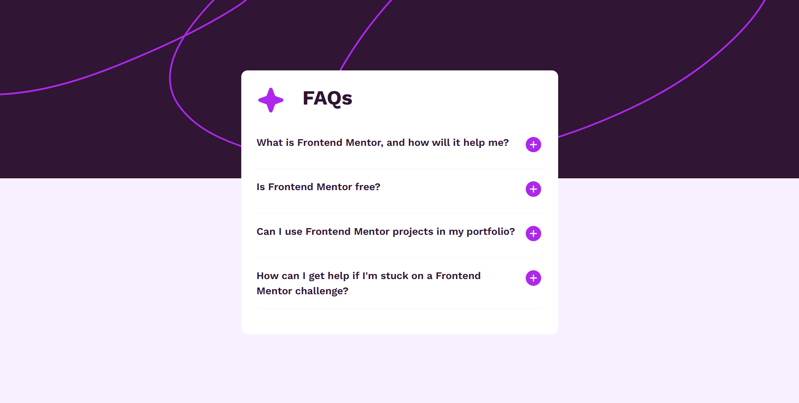

# Frontend Mentor - FAQ accordion solution

This is a solution to the [FAQ accordion challenge on Frontend Mentor](https://www.frontendmentor.io/challenges/faq-accordion-wyfFdeBwBz). Frontend Mentor challenges help you improve your coding skills by building realistic projects.

## Table of contents

- [Overview](#overview)
  - [The challenge](#the-challenge)
  - [Screenshot](#screenshot)
  - [Links](#links)
- [My process](#my-process)
  - [Built with](#built-with)
  - [What I learned](#what-i-learned)
  - [Continued development](#continued-development)
- [Author](#author)

**Note: Delete this note and update the table of contents based on what sections you keep.**

## Overview

### The challenge

Users should be able to:

- Hide/Show the answer to a question when the question is clicked
- Navigate the questions and hide/show answers using keyboard navigation alone
- View the optimal layout for the interface depending on their device's screen size
- See hover and focus states for all interactive elements on the page

### Screenshot



### Links

- Solution URL: [Add solution URL here](https://your-solution-url.com)
- Live Site URL: [Add live site URL here](https://your-live-site-url.com)

## My process

1. Began with a mobile-first approach.
2. I then used HTML to structure the elements for the accordion.
3. Next, was using CSS to style and beautify, and control the responsiveness of the page.
4. Lastly, I used vanilla JS to control the **"plus"** and **"minus"** images.

### Built with

- Semantic HTML5 markup
- CSS custom properties
- Flexbox
- CSS Grid
- Vanilla JS
- Mobile-first workflow

### What I learned

I learnt of the **<details></details>** and **<summary></summary>** tags. They have in-built functionality of controlling the appearance and disappearance of the questions in the FAQ accordion.

```html
<h1>Some HTML code I'm proud of</h1>

<details>
  <summary>
    What is Frontend Mentor, and how will it help me?
    <span class="plus-img">
      
    </span>
  </summary>
  <p>
    Frontend Mentor offers realistic coding challenges to help developers
    improve their frontend coding skills with projects in HTML, CSS, and
    JavaScript. It's suitable for all levels and ideal for portfolio building.
  </p>
</details>
```

### Continued development

- Vanilla JS
- CSS

## Author

- Website - [Kofi Baafi Kwatia](https://github.com/WesSno)
- Frontend Mentor - [@WesSno](https://www.frontendmentor.io/profile/WesSno)
